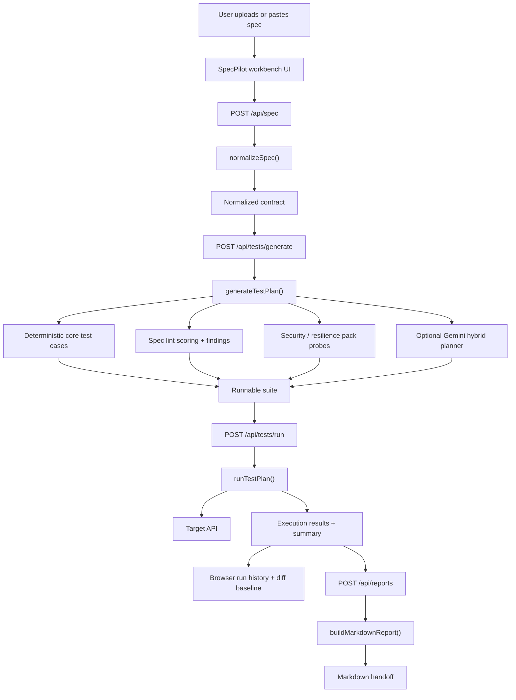

# SpecPilot

SpecPilot is a contract-grounded API testing copilot built with Next.js. It turns an OpenAPI or Swagger document into a scoped test suite, runs those checks against a live API, and produces a bug-ready markdown handoff for issues, PRs, or QA reports.

It is designed as a flagship GenAI portfolio project: the product uses AI where it helps, but the workflow stays grounded in the uploaded contract and the execution evidence stays reproducible.

## Live Demo

- Live app: [https://specpilot-ruby.vercel.app/](https://specpilot-ruby.vercel.app/)
- Source code: [https://github.com/Adi1816/specpilot](https://github.com/Adi1816/specpilot)

If you are reviewing the project for the first time, open the live app and walk through the bundled demo flow:

1. `Load demo spec`
2. `Analyze spec`
3. `Generate test plan`
4. `Run suite`
5. `Copy report`

That path shows the full end-to-end product without requiring any external API.

## What SpecPilot Does

1. Accepts an OpenAPI 3.x or Swagger 2.0 file in JSON or YAML.
2. Normalizes the contract into typed operations, parameters, request bodies, responses, and security hints.
3. Lets the user choose which endpoints to include in the first pass.
4. Scores the selected contract surface with deterministic linting before execution.
5. Generates a layered suite with deterministic core cases, pack probes, and optional Gemini-prioritized hybrid edge cases.
6. Executes the suite against a real base URL and stores browser-side checkpoints for comparison.
7. Produces a markdown report with coverage, outcomes, latency, diff-ready evidence, and failure details.

## Why This Project Is Strong

- It solves a real workflow instead of wrapping a model in a chat UI.
- It blends deterministic software engineering with optional AI augmentation.
- It demonstrates structured input handling, evaluation thinking, and product design.
- It produces an artifact that is actually useful to engineers: a bug-ready execution report.

## Key Features

- Paste or upload OpenAPI 3.x and Swagger 2.0 specs.
- Normalize operations, schemas, security schemes, and response expectations.
- Filter and select endpoints for a deliberate first-pass suite.
- Generate deterministic test cases across happy-path, validation, auth, and missing-resource scenarios.
- Score the contract with deterministic quality signals for examples, schema design, error coverage, security, and docs.
- Add deterministic security and resilience pack probes in enhanced mode.
- Optionally generate Gemini-powered planning insights and promoted hybrid edge cases when `GEMINI_API_KEY` is configured.
- Execute tests against a live API target with auth-aware request construction.
- Save execution checkpoints in browser history and diff the latest run against prior baselines.
- Capture expected versus actual status patterns, latency, and response previews.
- Export a markdown handoff for issues, PR comments, QA summaries, or demos.
- Includes a built-in demo commerce API so the full experience works end to end without external infrastructure.
- Includes premium 3D product scenes and a presentation-focused UI layer for portfolio demos.

## Product Flow

SpecPilot is intentionally structured as a guided six-step workflow:

1. Load the contract
2. Inspect and select the API surface area
3. Configure the run
4. Review the generated suite, contract score, pack probes, and promoted hybrid scenarios
5. Inspect the execution board, saved checkpoints, and baseline diffs
6. Copy the markdown handoff

The UI is built to feel like a premium product demo rather than a raw dashboard, while the underlying logic remains deterministic and inspectable.

## Phase 1 Highlights

Compared with the earlier version, the current Phase 1 build adds a much stronger product layer:

- Deterministic contract linting with a surfaced contract score and issue breakdown.
- A plan narrative that explains what the generated suite is optimized to catch.
- Clear separation between deterministic pack probes and AI-prioritized hybrid scenarios.
- Saved run history in the browser with baseline selection and run-to-run diffing.
- Richer execution evidence so the workbench behaves more like a real QA/devtool product.
- 3D portfolio scenes and polished workflow presentation for a stronger public demo.

## Architecture



## Tech Stack

- Next.js 16 App Router
- React 19
- TypeScript
- Tailwind CSS v4
- Zod
- YAML
- Three.js with React Three Fiber / Drei
- Gemini API for optional structured planning and risk prioritization

## Quick Start

### 1. Install dependencies

```bash
npm install
```

### 2. Create your local environment file

```bash
cp .env.example .env.local
```

### 3. Add optional AI credentials

If you want the enhanced Gemini planner, set:

```env
GEMINI_API_KEY=your_key_here
GEMINI_MODEL=gemini-2.5-flash
```

If you skip the API key, the app still works fully and falls back to deterministic planning.

### 4. Start the dev server

```bash
npm run dev
```

### 5. Open the app

Go to the local URL shown by Next.js and walk through the guided flow.

## Demo Run

SpecPilot includes a built-in demo commerce API that ships with the app.

To run the full demo locally:

1. Open the home page.
2. Click `Load demo spec`.
3. Click `Analyze spec`.
4. Review or adjust the preselected endpoints.
5. Click `Generate test plan`.
6. Click `Run suite`.
7. Review the execution board and copy the markdown report.

The app will automatically prefill:

- a base URL that points at the bundled demo API
- a demo auth token for protected routes

This gives you a complete end-to-end walkthrough without relying on any external service.

If you run the suite multiple times, the latest build will also persist browser-side run history and unlock baseline diffing inside the execution board.

## Environment Variables

| Variable | Required | Purpose |
| --- | --- | --- |
| `GEMINI_API_KEY` | No | Enables the optional Gemini-powered planner in the enhanced strategy |
| `GEMINI_MODEL` | No | Overrides the default Gemini model. Defaults to `gemini-2.5-flash` |

## Scripts

| Command | Purpose |
| --- | --- |
| `npm run dev` | Start the development server |
| `npm run build` | Create the production build |
| `npm run start` | Run the production server |
| `npm run lint` | Lint the project |
| `npm run typecheck` | Run TypeScript without emitting files |

## Project Structure

```text
src/
  app/
    api/
      spec/             analyze and normalize the uploaded contract
      tests/generate/   build the test plan
      tests/run/        execute the generated suite
      reports/          produce the markdown handoff
      demo/             bundled mock API used for the local and hosted demo
    globals.css         UI theme and motion system
    layout.tsx          app metadata and fonts
    page.tsx            entry point for the workbench
  components/
    spec-pilot-3d-scenes.tsx  social orbit and executive 3D product scenes
    spec-pilot-workbench.tsx  main guided workflow UI and execution board
  lib/
    openapi.ts          parsing, normalization, sample generation
    test-engine.ts      suite generation, spec linting, hybrid planning, execution, and report creation
    run-history.ts      browser-side saved checkpoints and diffing helpers
    ai.ts               optional AI memo generation
    demo-spec.ts        bundled demo OpenAPI contract
    demo-api.ts         demo API helpers
    types.ts            shared Zod schemas and TypeScript types
```

## Deploying

SpecPilot deploys cleanly to Vercel as a standard Next.js application.

For the full step-by-step deployment flow, environment setup, smoke tests, and launch checklist, see [DEPLOYMENT.md](./DEPLOYMENT.md).

## Portfolio Positioning

If you are showcasing this project in an interview, README, or LinkedIn post, position it like this:

> SpecPilot is an AI-assisted API testing copilot that stays grounded in the uploaded contract, generates reproducible checks, runs them against live endpoints, and turns failures into shareable engineering-ready reports.

You can also emphasize that the project demonstrates:

- contract-aware product design
- deterministic contract review and hybrid coverage planning
- typed backend integration
- deterministic evaluation
- regression-oriented execution history and diffing
- optional AI augmentation instead of AI dependence
- clean UX thinking for technical workflows

## Suggested Resume Bullets

- Built a Next.js and TypeScript application that converts OpenAPI contracts into layered API test suites, execution dashboards, baseline diffs, and markdown QA reports.
- Designed a hybrid workflow where deterministic contract linting and pack probes stay in control while Gemini prioritizes only the highest-value edge cases.
- Implemented typed route handlers, contract normalization, auth-aware execution, browser-side run history, and end-to-end reporting in a portfolio-ready engineering tool.

For GitHub description text, LinkedIn copy, demo scripts, and presentation-ready project messaging, see [PORTFOLIO_ASSETS.md](./PORTFOLIO_ASSETS.md).

## Verification

Before shipping or presenting the project, run:

```bash
npm run typecheck
npm run lint
npm run build
```

## License

Add a license that matches how you want to share the project publicly.
